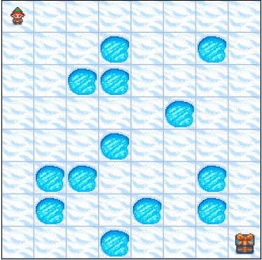

# CS143-SP26-P5
Course: CS143 – Artificial Intelligence (Spring 2026)

Instructor: Md Alimoor Reza, Assistant Professor of Computer Science, Drake University

Due: Tuesday, April 21, 11:59 PM
Total: 8 points

## Solving Frozen Lake Game with Value Iteration Algorithm

The goal of this assignment is to solve an AI problem using **reinforcement learning** techniques such as the **value iteration algorithm** on a Markov Decision Process (MDP) with known dynamics. You will work with an AI agent that interacts with a simulated environment using the Gymnasium library.

  

Note that you should adapt the value iteration algorithm implementation provided as a skeleton for a simple dice game. Your task is to complete the implementation by filling in the missing components and addressing all associated tasks. Your code must follow the provided format.
## Task 1 
Implement the **value iteration algorithm on 4x4 non-slippery (deterministic) frozen lake**

## Task 2 
Implement the **value iteration algorithm on 4x4 slippery (stochastic) frozen lake**

## Task 1 
Implement the **value iteration algorithm on 8x8 non-slippery (deterministic) frozen lake**

Complete and run three instances of Frozen Lakes (Exercises#1-3) with value iteration algorithm. Make sure the run the inferences after finishing the value iteration so that I can you trace the path the agent is taking on the maps.

> You should complete the exercises and then write some observations.

| **Problem Instance**     | **#of iterations during training** | **time took** | **# of actions during inference** |
|---------------|--------------------|----------------|----------------|
| 4x4 non-slippery FL|                    |                   |                |
| 4x4 slippery FL|                    |                   |                |
| 8x8 non-slippery FL|                    |                   |                |

Also include a text/Markdown cell that addresses the following points:

1. Explain the basis on which the path costs are computed.

2. Specify how different values of the discount factor $\gamma$ affected your value iteration algorithm. You should try at least one of the three instances of FrozenLake and make a note of your observations.

3. Provide a brief description of the modifications made to the code.

4. Discuss any differences observed—using the comparative table above—in the computed routes, execution time, number of nodes expanded, and related metrics.

### Grading

The assignment is worth 8 points. Partial credit (up to 6 points) will be awarded if any of the required components are incomplete.

* Up to 6 points: You made code changes that demonstrate a reasonable attempt to complete the implementation of the **value iteration algorithm on FrozenLake** instances.

* Up to 7 points: You tuned the discount factor $\gamma$ at least once in one of the three value iteration experiments.

* Up to 8 points: You filled out the comparative analysis table above with all entries. You implemented a working version of the value iteration algorithm on all three FrozenLake instances and recorded the corresponding results in the table above.

### Turning it in

Share the notebook in the same way you did for Project 4.
